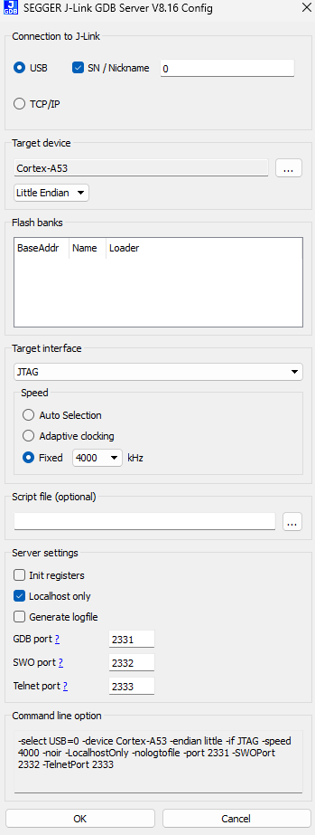
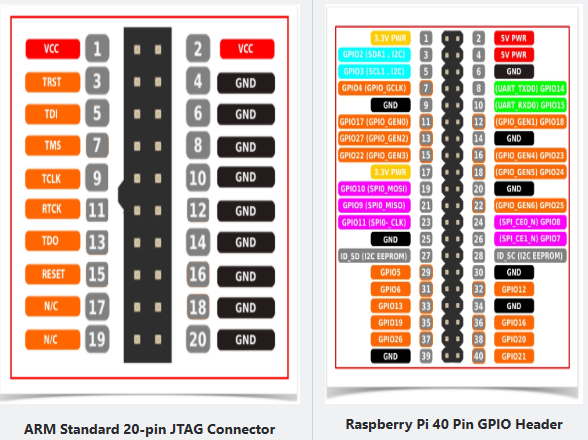
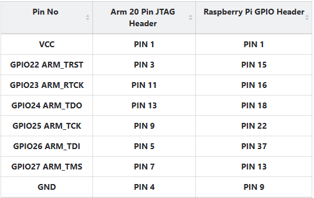

# JTAG debugging 101

Mar 2025, 2021


*Picture above: A JTAG debugger (blackbox), among other things, connected to an Rpi3 board.* 

## the concepts

JTAG is a special hardware connection to a target board, allowing debugging of the target board in situ -- watching registers,  setting breakpoints, observe memory contents. The goal is to have similar **interactive** expeirence as QEMU. 

terminlogy: 
- JTAG debugging: use a JTAG debugger to attach to a target processor (e.g. bcm2835 on raspiberry pi3). 
The jtag debugger serevrs as a bridge bewteen the development machine, communicateing the deubgigng commands (read/write of memory, registers...) with the target processor.

- self-hosting debugging: without an externl debugger, the target system implemensgt software debugging logic as part of the OS. 
THe logic includes printf via UART, a tracebuffrer, and hardware breakpoint/watchpoint as supported by the processor. 

comparison: 
jtag debugging: 
- pros: interactive, can easily watch lots of infromation, less code written; 
cons: effort needed to set up 
(both hardware wiring and software tools), 
debugging connection brittle and can break from time to time, 
runs slower (execution, single stepping) 

self-hosting debugging:
- mostly about collecting information (either in relatime such as UART messages, or post-mortem such as kernel event trace and cpu instruction trace) and analyze

- less setup. 

- cons: more debugging code to write, which itself may introduce new bugs (e.g. deadlock in tracebuffer) 


VErdict: JTAG debugging shall not be regarded as a debugging manner to replace self-host debugging. 
JTAG is more suitable debugging baremetal or embedded systems (or early bootstage of an OS kernel).

## status -- jtag debugging for rpi3

as of feb 2025, there are two possible solutions: 

solution 1: 

- cheap FTDI-based (FT2232H) jtag debugger (undedr $50).
the chip itself is FT2232H, which is a USB-to-JTAG bridge.
It is a very simple chip, translating the debug commands from the host USB to the serial commands to the target board.

the softeware tool is openocd, which supports a large variety of target boards, including raspi3 and 4. 
openocd can run on Linux (including in a VM), WSL2 (through USB device passthrough), and natively on Windows. 

the downside is that openocd only implements the most basic set of debugging commands, and mplements in the most basic way. 
Examples: 

- breakpooint is set by overwritting instrtuctions in the memory, insteawd of using the hardware breakpoint feature of the processor.

- execution with **conditional** breakpoint equipped is slow (it might be impelmented by check for the condition every time the breakpoint is hit) 

- cannot reset the target board to 'halt'. therefore must attach the debugger whiel putting the target in "waiting" and not freely running. 

- cannot read/write system registers, including debugging registers such as DBGBCR0_EL1 

solution 2: 

- more expensive debugger, such as Segger's J-Link.
Its educationl verison is $60, and the full version is $500 or more. 
while the software tool is more promising, it lacks official support for raspiberry pis (board level). there is no such option from the drop-down menu. 
as a result, while the JLink debugger can recognize the SoC, it will complain ``Error: CTI connected to core not found. Debugging not possible''. 
[discussion](https://stackoverflow.com/questions/58480411/j-link-connection-to-cortex-a53-raspberry-pi3b).
(also reported to work with rpi4, [discussion](https://forum.segger.com/index.php/Thread/9280-SOLVED-Ask-again-for-Raspberry-Pi-connect/).
it seem that the company more focused on microcontroller boards. 



- therefore, dspite Jlink's rich software support,  the only soultion to use it with rpi3 is OpenOCD, which suffers from all drawbacks mentioned above..

## Howto

### hardware wiring 

(TBD)





### the rpi3 config.txt 

add the following lines: 
```
enable_jtag_gpio=1
gpio=23-27=a4
gpio=22=a4,pu
```
The idea is to put the gpios used for JTAG connection for "alternate function 4". gpio22 is special, which connects to the jtag TRST signal. It must be pulled up.
[discussion](https://forums.raspberrypi.com/viewtopic.php?t=286115)

### the openocd commands

it needs to configuration files: for target (rpi3) and for the debugger (jlink).

the config files that come with the openocd package works. 

an example run.bat thta launcehs the openocd gdb server. the file can be placed in the openocd directory.

```
@echo off
cd /d "%~dp0"
bin\openocd.exe -f share/openocd/scripts/interface/jlink.cfg -f share/openocd/scripts/board/rpi3.cfg -c "bindto 172.26.96.1"
REM bin\openocd.exe -f share/openocd/scripts/interface/jlink.cfg -f rpi3.cfg -c "bindto 172.26.96.1"
pause
```

in the example above, the server listens at 172.26.96.1 which is the windows machine's IP address wrt the WSL2 VM.
This allows gdb to connect from the WSL2. 


**caveats**: 
better to kill and restart openocd every time the target board is reset; otherwise the gdb may show some stale values (old PC from previous run, or all zeros for instructions and memory). 

#### workflow

1. Kill `openocd`.
2. Kill `gdb`.
3. Reset the target board.
4. Start `openocd`. This will attach to the running target and halt it at the current instruction.
5. Start `gdb`.

b/c of step 4 above, the target code (OS) should be written in a way, waiting for the debugger to attach. (otherwise we have no control which code is being executed when the debugger attaches).
This can be done by adding code to the OS waiting for a character from UART. 

Q: how to attach JTAG during the boot.S code? maybe use an infinite loop waiting for attachment, and after that change the loop condition from the JTAG, and continue the boot process?

#### setting breakpoint

b/c when we attach to the target, it runs the kernel code at EL1. 
suppose GDB loaded the kernel elf (`file kernel8.elf`) already, we can set breakpoint like `b schedule()`. 

At this time, setting a breakpoint at user code can only be done when the user address space is ``activated'' (i.e. TTBR0 is set to the user page table).

so set a kernel breakpoint, e.g. right before a `exec()` syscall returns. 
From there, set a breakpoint at the user code, e.g. `b*0x1000`. 

Before continue, all kernel breakpoints shall be disarmed, e.g. `del 1`; 
otherwise once we return to EL0, gdb will try to "re-install" all these bkreaoints but cannot access kernel memory from EL0 -- hence errors. Continue with `c`.

Once the user breakpoint is hit, load the user symbols via (`file user.elf`). and then can inspect the user memory, variables, etc. 

A caveat is that we cannot proceed to the next instruction, from the user breakpoint. Even deleting the breakpoint does not help. The user code seems stuck there forever. 


References:

https://metebalci.com/blog/bare-metal-raspberry-pi-3b-jtag/

https://www.suse.com/c/debugging-raspberry-pi-3-with-jtag/

https://www.linaro.org/blog/open-on-chip-debugger-ocd-at-linaro/

https://collaborate.linaro.org/display/TCWGPUB/OpenOCD+for+AArch64

https://linaro.atlassian.net/wiki/spaces/TCWGPUB/pages/25296346120/Raspberry+Pi+Linux+kernel+debugging+with+OpenOCD

https://linaro.atlassian.net/wiki/spaces/TCWGPUB/pages/25296346120/Raspberry+Pi+Linux+kernel+debugging+with+OpenOCD

